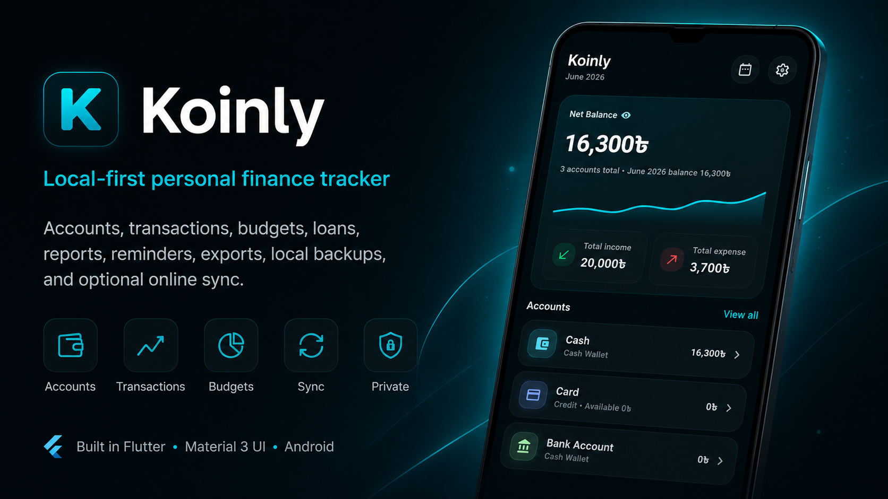
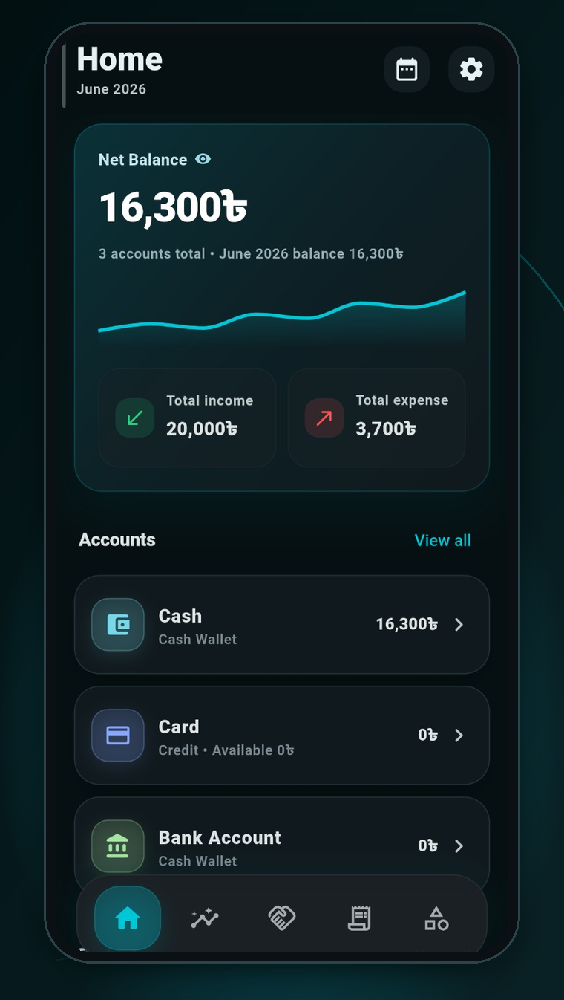
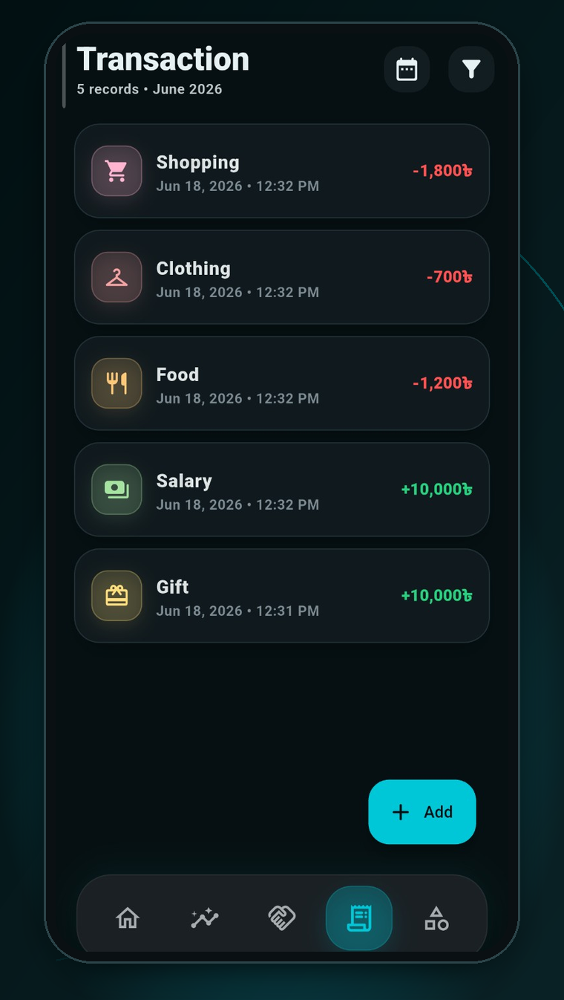
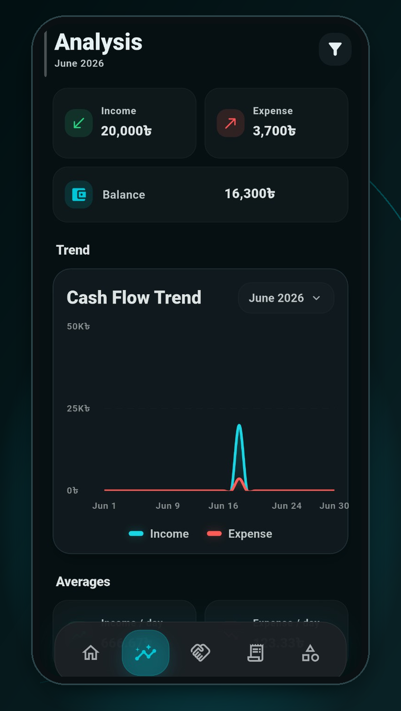

# Koinly

A local-first personal finance tracker built in Flutter with a polished Material 3 mobile and desktop UI. Koinly helps users manage accounts, transactions, categories, budgets, savings, reminders, reports, exports, and local backups from one Android or Windows app.



---

## App versioning

- Baseline source version: `1.0.70+71`
- GitHub Actions automatically stamps each release build with a newer version.
- Generated version format: `1.0.<1000 + github.run_number>`
- Android `versionName`, Android `versionCode`, `pubspec.yaml`, Windows installer version, and the in-app About screen version are updated during CI.
- Manual edits to `pubspec.yaml`, `android/app/build.gradle`, and `lib/main.dart` are no longer required for normal release version bumps.
- Windows installer output remains `KoinlySetup.exe`.
- Stable production tags use semantic versions such as `v1.0.1042`.
- In-app update checks read public GitHub Releases from `SiamTestingProject/Koinly`.

---

## Project status

| Area | Current implementation |
| --- | --- |
| App framework | Flutter / Dart |
| Platforms | Android and Windows |
| UI system | Dark glass finance dashboard inspired by the latest Koinly mockup, with cyan accents, compact cards, centered popups, and adaptive spacing |
| Local database | SQLite via `sqflite` and desktop SQLite FFI |
| State management | `provider` + `ChangeNotifier` |
| Analytics/crash reporting | Firebase Analytics + Crashlytics with optional initialization |
| Online sync | Account-based automatic multi-device sync |
| Sync backend | Cloudflare Worker API |
| Cloud database | Turso, accessed only by the Worker |
| Local sync state | SQLite outbox, cursor, entity versions, and conflict records |
| Backup/restore | Local `.koinlybackup` files |
| CI build | GitHub Actions for Android APKs and Windows installer |
| Android outputs | Universal, ARM32, ARM64, x86_64 release APKs and Android App Bundle |
| Windows output | `KoinlySetup.exe` |
| License | Apache License 2.0 |

---

## In-app updates

Koinly includes a GitHub Releases-based updater.

- Automatic update check runs after app startup.
- Manual update check is available in **Settings → Updates**.
- Draft GitHub releases are ignored.
- Prereleases are ignored in production builds and can be included in development builds with `KOINLY_INCLUDE_PRERELEASE_UPDATES=true`.
- Version comparison is semantic, so `1.4.10` correctly sorts after `1.4.8`, and `1.10.0` correctly sorts after `1.4.10`.
- Release notes are fetched from the actual GitHub Release body and rendered inside the app.
- Android downloads APKs in-app and opens Android’s installer automatically after download.
- If Android blocks unknown-app installs, Koinly opens the system “Allow from this source” page and resumes installation when the user returns.
- If the installer is cancelled after a successful download, **Settings → Updates** shows an install action for the existing APK instead of forcing another download.
- Windows prefers semantic installer assets such as `Koinly-v1.0.1042-Setup.exe`; if no installer is available, the GitHub release page opens.
- Android CI generates the Universal APK from the AAB with bundletool, avoiding one extra full Flutter Android compile.

Expected release assets:

- `Koinly-v<version>-arm64.apk`
- `Koinly-v<version>-arm32.apk`
- `Koinly-v<version>-x86_64.apk`
- `Koinly-v<version>-universal.apk`
- `Koinly-v<version>.aab`
- `Koinly-v<version>-Setup.exe`

Release notes come from `CHANGELOG.md`. The workflow first looks for the current version section, then falls back to `## Unreleased`, so stable releases still publish meaningful notes instead of a generic one-line body.

---

## Visual design

- Deep navy app background with lightweight cyan accents.
- Glass-style cards and bottom navigation with subtle borders and shadows.
- Home dashboard focuses on balance, accounts, budgets, and category spending without the old Quick actions block.
- Balance, account, transaction, and category surfaces use the same compact rounded-card language across Android and desktop.

---

## Performance notes

- App shell rebuilds are scoped to the values that actually affect the shell, such as theme and selected tab.
- Account, category, reminder, and balance lookups are cached after every database reload so long lists do not repeatedly scan the full in-memory dataset.
- Money formatting reuses cached formatters instead of creating a new formatter for every visible amount.
- Home dashboard category totals reuse the already-filtered transaction list.
- Background online sync uses incremental pulls and avoids global busy-state rebuilds; manual sync/sign-in can still fully overwrite local finance data when required.
- Small icon images use medium filtering to reduce GPU work while scrolling.
- Page transitions now use shorter fade-only motion, and the heavy background glow layers were removed to reduce animation jank on both Windows and Android.

---

## README sync note

This README was rebuilt by comparing the current Koinly version with the uploaded `Koinly-main.zip`.

Kept from the uploaded version where still accurate:
- clean project status section
- feature grouping
- backend setup references
- build instructions
- troubleshooting structure
- API/backend documentation style

Added for the current app:
- Windows installer workflow and `KoinlySetup.exe`
- automatic GitHub Actions version stamping
- Windows title/executable branding as `Koinly`
- Material 3 Expressive UI behavior
- onboarding login/create-account actions
- onboarding skip-accounts flow that removes untouched starter accounts
- Hidden Settings naming
- single-toggle category filters
- account-based automatic multi-device sync
- server-authoritative sync download behavior
- Financial Health Summary popup behavior
- daily 10 Savings Account suggestion bubbles
- budget alert summary behavior


## Core data rules

Koinly is strict about money classification.

- Income counts only as income.
- Expense counts only as expense.
- Regular transfers are internal.
- Savings transfers are internal and never count as income or expense.
- Bills and subscriptions are tracked separately for reminders and summaries.
- Budget usage comes from real expense category spending.
- Exports follow active filters.

---

## Features

### Accounts

Koinly supports regular accounts, credit accounts, and Savings accounts. Users can create, edit, delete, reorder, color, and icon-tag accounts. Account balances appear across Home and account pages. Savings balances are kept separate from normal operating balances.

### Transactions

Koinly supports income, expense, and transfer transactions with date/time, amount, account, category, and notes. Filters support date range, account, category, and transaction type. Transfer records avoid category double counting. Savings movements stay out of income/expense totals.

### Categories

Income and expense categories are managed from one page. Expense/Income uses one toggle button. Category cards use icons and colors. Category detail pages show real category transactions only. Transfer and Savings transfer rows are excluded from category spending pages.

### Budgets

Budgets support monthly limits, category scope, account scope, progress tracking, remaining budget, and alert levels. Status can be safe, warning, near limit, limit reached, or overspent. Budget data is included in Financial Health Summary.

### Savings

Savings has a dedicated Savings Accounts page. Transfers into and out of Savings are internal transfers. Savings activity appears separately in summaries. Savings suggestion profile is available in Settings. The Savings page shows 10 daily mystery `?` suggestion bubbles. Tapping a bubble opens the full suggestion. Checked suggestions are saved for the day. After all 10 are checked, no more appear until the next day.

### Financial Health Summary

Financial Health Summary is not a fixed Analysis page section. It appears automatically after a month or year ends. Users can go through summary pages or skip all. Skipped and reviewed summaries are remembered.

The summary includes income, expenses, net flow, savings transfers, savings balance movement, current savings balance, recurring bills/subscriptions, paid/unpaid/upcoming/overdue bills, budget usage, remaining budget, overspent categories, and a health result.

Possible status results include Saved Money, Overspent, Increased Debt, Reduced Debt, Stable Month, Stable Year, and Strong Savings Growth.

Yearly view includes month-by-month income, expense, savings, bills, budget usage, best month, worst month, highest income month, highest expense month, highest savings month, and most overspent month.

### Reminders

Reminder-related data supports bills, subscriptions, tuition, rent, internet bills, mobile recharge, electricity bills, EMI payments, scheduled payments, and overdue alerts. Reminder status is included in Financial Health Summary.

### Analysis and reports

The Analysis page remains focused on charts and analytics: income/expense charting, cash flow trend, category breakdown, budget usage context, filter-aware summaries, responsive chart cards, and Material 3 Expressive-style spacing. Financial Health Summary appears as a period-end popup, not as a permanent Analysis card.

### Exports

Koinly supports CSV export, PDF export, filter-aware export data, shared export files, and summaries based on active filters.

### Settings

Settings includes theme, currency, currency symbol/code, prefix/suffix placement, number separators, daily reminder time, default account, default expense category, default income category, default date filter, Savings suggestion profile, backup/restore, app lock/security, About, privacy policy, terms, and licenses.

### Hidden Settings

Hidden Settings keeps secondary controls away from the main workflow. Examples include defaults, reorder tools, backup tools, and lock/security options.

---

## Online data sync

Koinly now uses account-based, local-first online sync.

The active user flow is:

1. Open Settings.
2. Open Account & sync.
3. Create an account or sign in.
4. Continue using Koinly normally.

The Cloudflare Worker URL is embedded at build time through the GitHub
Actions/Flutter define `KOINLY_SYNC_API_BASE_URL`; it is not shown as an app
setting.

Normal app operations save to local SQLite first, update the UI immediately, and add an operation to the local `sync_outbox`. The background coordinator batches pending operations, pushes them to the Worker, pulls remote changes by server cursor, and applies them locally.

No Turso database token is stored in Flutter. The app talks to:

```text
Koinly Flutter -> Cloudflare Worker -> Turso
```

The older manual snapshot-style sync code and `backend/cloudflare-turso/` reference backend are retained as legacy reference material, but Account & sync is the normal multi-device path.

---

## Backup and restore

Backup files use `.koinlybackup`. Backup includes local app data and preferences. Restore replaces local data with backup contents. Local-only use does not require a sync account.

---

## Screenshots

| Home | Transactions |
| --- | --- |
|  |  |

| Categories |
| --- |
|  |

| Analysis |
| --- |
|  |

---

## Tech stack

| Layer | Technology |
| --- | --- |
| UI | Flutter |
| Language | Dart |
| State | Provider |
| Local database | SQLite |
| Android database | `sqflite` |
| Desktop database | `sqflite_common_ffi` |
| Charts | `fl_chart` |
| PDF export | `pdf` + `printing` |
| File picker | `file_picker` |
| Sharing | `share_plus` |
| Secure storage | `flutter_secure_storage` |
| Biometrics/device auth | `local_auth` |
| Notifications | `flutter_local_notifications` |
| Time zones | `timezone` |
| Firebase | Analytics + Crashlytics |
| HTTP | `http` for Worker API sync |
| MongoDB | `mongo_dart` retained for legacy sync code |
| IDs | `uuid` |

---

## Project structure

```text
.
├── .github/
│   └── workflows/
│       └── build-android-apks.yml
├── android/
│   └── app/
├── assets/
│   ├── icons/
│   └── images/
├── backend/
│   └── cloudflare-turso/
├── lib/
│   └── main.dart
├── tools/
│   └── windows/
├── pubspec.yaml
├── analysis_options.yaml
├── README.md
└── LICENSE
```

The app is currently implemented mainly in `lib/main.dart`. GitHub Actions can regenerate platform files where needed. The Windows workflow generates Windows platform files before packaging. The installer artifact remains `KoinlySetup.exe`.

---

## Data model overview

The app stores local data for accounts, categories, transactions, budgets, savings suggestion profile, daily savings suggestion seen status, settings/preferences, backup metadata, and sync metadata. Legacy loan tables are preserved internally for backup/sync compatibility while the user-facing loan feature is hidden for now.

Important classification fields include transaction type, account IDs, category ID, transfer target, created date/time, reminder status, and budget scope.

---

## Requirements

Android:
- Flutter stable
- Java 17
- Android SDK/build tools
- NDK configured by workflow
- Gradle wrapper restored/configured by workflow

Windows:
- Flutter stable
- Windows desktop support
- Visual Studio Build Tools with Desktop C++ workload
- Inno Setup in CI
- optional code signing certificate

---

## Local setup

Install dependencies:

```bash
flutter pub get
```

Run Android:

```bash
flutter run
```

Run Windows:

```bash
flutter config --enable-windows-desktop
flutter run -d windows
```

Build universal APK:

```bash
flutter build apk --release
```

Build ARM32/ARM64 APKs:

```bash
flutter build apk --release --split-per-abi
```

Build Windows release:

```bash
flutter build windows --release
```

---

## GitHub Actions build

Workflow:

```text
.github/workflows/build-android-apks.yml
```

The workflow builds:

```text
artifacts/Koinly-v<version>-universal.apk
artifacts/Koinly-v<version>-arm32.apk
artifacts/Koinly-v<version>-arm64.apk
artifacts/Koinly-v<version>-x86_64.apk
artifacts/Koinly-v<version>.aab
artifacts/Koinly-v<version>-Setup.exe
```

Workflow behavior:
- supports manual dispatch
- supports push to `main` or `master`
- cancels older in-progress release builds on the same branch when a newer push starts
- requires `KOINLY_SYNC_API_BASE_URL` as a GitHub repository secret or variable
- automatically stamps each build version from `github.run_number`
- passes the generated version into Flutter through `KOINLY_APP_VERSION`
- updates Android `versionName` and `versionCode` before APK builds
- updates `pubspec.yaml` before Windows installer packaging
- uses Flutter/Gradle caching where available
- uses `--no-pub` after dependency restore so release builds do not resolve packages repeatedly
- generates the Universal APK from the AAB with bundletool instead of running a separate universal APK compile
- uploads already-compressed APK/EXE artifacts with artifact compression disabled for faster transfer
- preserves Android signing support
- preserves Windows signing support
- generates Windows installer
- publishes APKs, AAB, and the Windows setup installer to a new versioned stable GitHub Release for every build
- patches Windows CMake compatibility where needed
- patches the generated Windows runner title to show `Koinly`

Automatic versioning:

```text
BUILD_NUMBER = 1000 + github.run_number
VERSION_NAME = 1.0.<BUILD_NUMBER>
pubspec.yaml = VERSION_NAME+BUILD_NUMBER
Android versionName = VERSION_NAME
Android versionCode = BUILD_NUMBER
About screen = VERSION_NAME
Windows installer version = VERSION_NAME
```

App build config:

```text
KOINLY_SYNC_API_BASE_URL=https://koinly-sync-worker.koinlytest.workers.dev
```

The installer filename must stay:

```text
KoinlySetup.exe
```

Stable release publishing:

```text
Tag: v1.0.<BUILD_NUMBER>
Release title: Koinly Stable 1.0.<BUILD_NUMBER>
Assets:
- Koinly-v<version>-universal.apk
- Koinly-v<version>-arm32.apk
- Koinly-v<version>-arm64.apk
- Koinly-v<version>-x86_64.apk
- Koinly-v<version>.aab
- Koinly-v<version>-Setup.exe
```

Each successful build creates or updates only its own versioned release. Older
release builds remain available in GitHub Releases instead of being deleted by
the next update.

---

## Release signing

Android release signing support is preserved.

Typical Android secret names:

```text
ANDROID_KEYSTORE_BASE64
ANDROID_KEYSTORE_PASSWORD
ANDROID_KEY_ALIAS
ANDROID_KEY_PASSWORD
```

Windows code signing is optional.

Typical Windows secret names:

```text
WINDOWS_CODESIGN_PFX_BASE64
WINDOWS_CODESIGN_PASSWORD
WINDOWS_CODESIGN_TIMESTAMP_URL
```

If Windows signing is not configured, the installer still builds, but Windows may show SmartScreen warnings.

---

## Cloudflare + Turso backend

Active sync Worker folder:

```text
cloud/worker/
```

It contains the Cloudflare Worker API, Turso schema, package configuration, and deployment reference files.

Backend files:

```text
cloud/worker/src/index.ts
cloud/worker/schema.sql
cloud/worker/package.json
cloud/worker/wrangler.toml
cloud/worker/wrangler.toml.example
```

Worker runtime secrets:

```text
TURSO_DATABASE_URL
TURSO_AUTH_TOKEN
JWT_SECRET
```

GitHub Actions deployment expects all deployment values to be stored as
repository secrets:

```text
CLOUDFLARE_API_TOKEN
CLOUDFLARE_ACCOUNT_ID
TURSO_DATABASE_URL
TURSO_AUTH_TOKEN
JWT_SECRET
```

The deploy workflow passes `TURSO_DATABASE_URL`, `TURSO_AUTH_TOKEN`, and
`JWT_SECRET` to Cloudflare as Worker secrets with `wrangler deploy
--secrets-file`, so you can manage all deploy-time values from GitHub repo
Settings > Secrets and variables > Actions.

The same workflow also applies `cloud/worker/schema.sql` to Turso before
deploying the Worker. The schema is idempotent, so rerunning the workflow keeps
existing data and only creates missing tables/indexes.

The Cloudflare API token should use the `Edit Cloudflare Workers` template
for the target account. If you create a custom token manually, include:

```text
Account  > Workers Scripts   > Edit/Write
Account  > Account Settings  > Read
User     > User Details      > Read
User     > Memberships       > Read
```

Add `Zone > Workers Routes > Edit/Write` too if you use Worker routes or a
custom domain. If deploy fails with Cloudflare authentication code `10000`,
replace the GitHub `CLOUDFLARE_API_TOKEN` secret with a token that has these
permissions.

Deploy from terminal:

```bash
cd cloud/worker
npm install
npm run schema:apply
npx wrangler deploy
```

After deploy, open the Worker URL in a browser. `/` should return a JSON
service summary and `/health` should report `ok: true`, `databaseReachable:
true`, and `schemaReady: true`. The Worker also runs the idempotent schema
bootstrap before auth/sync requests, so missing tables are created
automatically if the GitHub Actions schema step was skipped.

---

## Legacy sync backend

The old `backend/cloudflare-turso/` snapshot/admin-approval backend is retained as reference material. It is not the normal multi-device sync path.

---

## Online sync user flow

1. User opens Account & sync.
2. The app uses the Worker URL embedded at build time through `KOINLY_SYNC_API_BASE_URL`.
3. User creates an account or signs in.
4. Existing local data is adopted into the account through the outbox.
5. Local changes are saved immediately and synced automatically in the background.
6. Other signed-in devices pull changes by cursor and update their local SQLite database.
7. A manual Sync now action remains available for troubleshooting.

---

## API endpoints

Backend endpoint definitions are in:

```text
cloud/worker/src/index.ts
```

Endpoint groups include auth registration/login/refresh/logout, initial sync, push, pull, and status.

---

## Troubleshooting

### Account & sync cannot connect

Check the Worker URL, Turso secrets, `JWT_SECRET`, and whether `cloud/worker/schema.sql` has been applied.

### Sync conflict appears

Koinly records stale-version conflicts locally instead of silently overwriting financial data. Use the newest synced device data as the source of truth before retrying a conflicting local edit.

### Admin panel says unauthorized

Check `ADMIN_KEY`.

### SQLite table errors in backend

Check schema, database credentials, Worker bindings, and deployment target.

### Android build fails after Flutter upgrade

Check Gradle wrapper, Android Gradle Plugin, Kotlin Gradle Plugin warnings, plugin compatibility, Java 17, SDK, and NDK setup.

### Kotlin Gradle Plugin warning

Flutter may warn that the Android app or plugins apply KGP. The current build can still succeed unless Flutter changes enforcement.

### Windows CMake warning

Firebase's bundled Windows C++ SDK may show old CMake policy warnings. The workflow patches Windows CMake files during CI.

### `KoinlySetup.exe` is missing

Check Windows platform generation, Flutter Windows build, Inno Setup, installer script output, and artifact path.

Expected path:

```text
artifacts/KoinlySetup.exe
```

### Firebase build errors

Check:

```text
android/app/google-services.json
```

### Release APK signing problem

Check Android signing secrets and Gradle signing configuration.

---

## License

Apache License 2.0.

See:

```text
LICENSE
```
