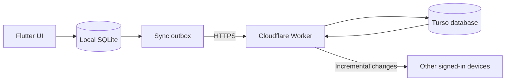

# Koinly

<p align="center">
  <a href="https://flutter.dev"></a>
  <a href="https://github.com/SiamTestingProject/Koinly/actions/workflows/build-android-apks.yml"></a>
  
  <a href="LICENSE"></a>
</p>

<p align="center">
  A private, local-first personal finance tracker for Android and Windows,<br>
  with optional default or fully self-hosted multi-device synchronization.
</p>

## Contents

- [Overview](#overview)
- [Features](#features)
- [Architecture](#architecture)
- [Quick start](#quick-start)
- [Build the app](#build-the-app)
- [Cloud sync](#cloud-sync)
- [Self-hosted cloud sync](#self-hosted-cloud-sync)
- [GitHub Actions](#github-actions)
- [Worker development](#worker-development)
- [Data safety and security](#data-safety-and-security)
- [Testing](#testing)
- [Troubleshooting](#troubleshooting)
- [Project structure](#project-structure)
- [Contributing](#contributing)
- [License](#license)

## Overview

Koinly helps users manage accounts, transactions, budgets, lending and
borrowing, categories, reports, and backups without requiring an online account. Finance data is
written to SQLite on the device first, so normal app use remains available
without an internet connection.

Cloud synchronization is optional:

- **Default cloud sync** uses the endpoint configured by the app distributor.
- **Self-hosted cloud sync** uses a Cloudflare Worker and Turso database owned
  by the user.
- **Local-only mode** sends no finance data to a sync backend.

The application never embeds Turso credentials. It communicates with the
selected sync service only through HTTPS requests to a Cloudflare Worker.

## Features

### Personal finance

- Multiple cash, bank, card, savings, and custom accounts
- Income, expense, and transfer transactions
- Required titles for income and expense transactions, shown throughout transaction history
- Optional start-to-end date ranges for a transaction, with its amount counted once
- Custom income and expense categories
- Monthly budgets with progress tracking
- Lending and borrowing records with contacts, repayments, due dates, and APR-based interest
- Optional account movements for loan activity without counting them as income or expense
- Cash-flow trends, category breakdowns, and financial summaries
- Search, date filters, and account/category filters
- Savings suggestions and planning tools

### Data and privacy

- Local-first SQLite storage
- No account required for local-only use
- Encrypted `.koinlybackup` backup and restore
- Automatic safety backups before destructive restore operations
- Automatic category deduplication during restore and sync, with transaction and budget references preserved
- Profile media is copied to private app storage and is not uploaded with finance sync data
- Android Photos and videos access is requested only for choosing profile media
- Platform secure storage for sync access and refresh tokens
- Sync credentials excluded from app backups
- Privacy-safe diagnostic reports in **Advanced settings > Data health**

### App experience

- Adaptive Material 3 interface
- Light, dark, and system themes
- Responsive Android and Windows layouts
- Customizable profiles with photo, animated GIF, or short-video media previews
- Private profile-media storage with an enforced 500 KB maximum file size
- Savings Suggestion preferences grouped with profile information in one screen
- Android daily reminder notifications
- GitHub Releases-based update checks
- Architecture-specific Android downloads and Windows installer updates
- Optional performance mode for desktop devices

### Synchronization

- Default or self-hosted cloud endpoint
- Background outbox for offline edits
- Multi-device pull when the app opens or resumes
- Idempotent operation processing
- Version-based conflict detection
- Manual cloud restore and authoritative local upload flows
- Tenant-isolated Worker queries and transactional Turso writes

## Architecture



Local SQLite is always the first write target. When sync is enabled, Koinly
queues operations locally, sends them to the selected Worker, and pulls remote
changes using a monotonic cursor. The Worker validates authentication,
deduplicates operation IDs, detects stale entity versions, and scopes every
database operation to the authenticated user.

## Supported platforms

| Platform | Status | Release output |
| --- | --- | --- |
| Android | Supported | ARM32, ARM64, x86_64, Universal APK, and AAB |
| Windows x64 | Supported | Inno Setup installer |

Other Flutter platform folders may be generated during development, but the
maintained release workflow targets Android and Windows.

## Quick start

### Requirements

| Tool | Purpose |
| --- | --- |
| Flutter with Dart `>=3.5.0 <4.0.0` | App development |
| Android Studio, Android SDK 36, and Java 17 | Android builds |
| Visual Studio with **Desktop development with C++** | Windows builds |
| Node.js 22 | Cloudflare Worker development |

### Clone and run

```bash
git clone https://github.com/SiamTestingProject/Koinly.git
cd Koinly
flutter pub get
flutter run
```

Choose a target explicitly when multiple devices are available:

```bash
flutter run -d android
flutter run -d windows
```

No sync endpoint is required for local-only use.

## Build the app

### Build-time values

| Dart define | Required | Purpose |
| --- | --- | --- |
| `KOINLY_APP_VERSION` | No | Overrides the displayed app version |
| `KOINLY_SYNC_API_BASE_URL` | No | Enables the managed **Default** sync option |
| `KOINLY_INCLUDE_PRERELEASE_UPDATES` | No | Includes prereleases in update checks when `true` |

If `KOINLY_SYNC_API_BASE_URL` is omitted, local-only use and runtime
self-hosted sync continue to work. Only the **Default** sync choice is
unavailable.

### Android

```bash
flutter build apk --release \
  --dart-define=KOINLY_APP_VERSION=1.0.1046 \
  --dart-define=KOINLY_SYNC_API_BASE_URL=https://your-default-worker.example.workers.dev
```

Local release builds require a configured Android signing key. The GitHub
Actions workflow can instead generate a temporary CI signing key for personal
or test builds; see [Android signing](#android-signing).

### Windows

```bash
flutter build windows --release \
  --dart-define=KOINLY_APP_VERSION=1.0.1046 \
  --dart-define=KOINLY_SYNC_API_BASE_URL=https://your-default-worker.example.workers.dev
```

Windows code signing is optional. Unsigned installers can trigger Microsoft
Defender SmartScreen warnings.

## Cloud sync

Open **Settings > Account & sync** inside Koinly.

| Mode | Endpoint | Registration |
| --- | --- | --- |
| Default | Compiled with `KOINLY_SYNC_API_BASE_URL` | Managed by the default service |
| Self-hosted | Entered and validated at runtime | First owner account; no registration key |

### Endpoint validation

Koinly accepts a custom endpoint only when:

- it is an HTTPS origin;
- it contains no path, query, or fragment;
- `GET /health` identifies the service as `koinly-sync`;
- the Worker reports that its required configuration is present;
- the Worker reports `first-user` registration mode for self-hosted use;
- Turso is reachable; and
- the database schema is ready.

After validation, account registration, login, token refresh, logout, upload,
download, restore, and automatic foreground synchronization all use the custom
Worker.

Changing between default and self-hosted services signs out the current sync
session because the two backends contain separate accounts and tokens. The
switch itself does not delete local finance data. A later cloud restore can
replace local data, so review the confirmation shown by the app.

## Self-hosted cloud sync

The recommended deployment path is deliberately simple:

```text
Fork repository
  -> create Turso database
  -> add GitHub configuration
  -> run Deploy User Self-Hosted Sync Worker
  -> copy workers.dev URL
  -> validate URL in Koinly
  -> create the first owner account
```

### 1. Fork the repository

Fork [`SiamTestingProject/Koinly`](https://github.com/SiamTestingProject/Koinly)
to your GitHub account. Open the fork's **Actions** tab and enable workflows if
GitHub asks for confirmation.

### 2. Create a Turso database

Install and authenticate the [Turso CLI](https://docs.turso.tech/cli/introduction),
then run:

```bash
turso db create koinly-sync
turso db show koinly-sync --url
turso db tokens create koinly-sync
```

Save the database URL and the full-access token returned by Turso. A read-only
token cannot support synchronization.

The deployment workflow applies `cloud/worker/schema.sql` automatically. The
schema is idempotent, so redeploying does not erase existing accounts or sync
data.

### 3. Create Cloudflare credentials

In Cloudflare:

1. Copy the target account ID.
2. Create an account-scoped API token from the **Edit Cloudflare Workers**
   template.
3. Limit the token to the account that will host the Worker.

The standard `workers.dev` flow needs these permissions:

```text
Account  > Workers Scripts   > Edit/Write
Account  > Account Settings  > Read
User     > User Details      > Read
User     > Memberships       > Read
```

Custom domains and Worker routes can require additional **Workers Routes**
permissions. They are not needed for a normal `workers.dev` deployment.

### 4. Choose the Worker name

Example:

```ini
CLOUDFLARE_NAME_U=my-koinly-sync
```

The name must contain 1-63 lowercase letters, numbers, or internal dashes. It
cannot begin or end with a dash.

Cloudflare includes the account subdomain in the final URL:

```text
https://my-koinly-sync.<account-subdomain>.workers.dev
```

The workflow resolves and prints the exact URL after deployment.

### 5. Add GitHub Actions configuration

Open the fork's:

**Settings > Secrets and variables > Actions**

Add these values:

| Name | Store as | Purpose |
| --- | --- | --- |
| `CLOUDFLARE_NAME_U` | Secret or variable | User Worker name passed to Wrangler |
| `CLOUDFLARE_API_TOKEN_U` | Secret | Deploys and inspects the user Worker |
| `CLOUDFLARE_ACCOUNT_ID_U` | Secret | Selects the user's Cloudflare account |
| `TURSO_DATABASE_URL_U` | Secret | Connects the user Worker to Turso |
| `TURSO_AUTH_TOKEN_U` | Secret | Authorizes user database reads and writes |
| `JWT_SECRET_U` | Secret | Protects passwords and signs user sessions |

`JWT_SECRET_U` must contain at least 32 characters. Generate a high-entropy
value with a password manager or OpenSSL:

```bash
openssl rand -hex 32
```

> [!IMPORTANT]
> Self-hosted deployments do **not** require `REGISTRATION_ADMIN_SECRET`,
> `REGISTRATION_KEY_CHAT_ID`, or `TELEGRAM_BOT_TOKEN`. Those values belong to
> the managed default service and should not be added to a user deployment.

Never commit real credentials to workflow files, Wrangler configuration,
`.env.example`, issues, or logs.

### 6. Deploy the Worker

Open:

**Actions > Deploy User Self-Hosted Sync Worker > Run workflow**

The workflow:

1. validates all required values;
2. installs locked Worker dependencies;
3. typechecks and tests the Worker;
4. applies the Turso schema;
5. uploads Turso and JWT credentials as Cloudflare Worker secrets;
6. deploys using `CLOUDFLARE_NAME_U`;
7. resolves the exact `workers.dev` endpoint; and
8. verifies the deployed `/health` response.

A configuration, authentication, database, schema, deployment, or health
failure stops the job with a clear error.

### 7. Verify the deployment

Copy **Worker URL** from the job summary and open:

```text
https://<worker-name>.<account-subdomain>.workers.dev/health
```

A ready self-hosted backend returns fields equivalent to:

```json
{
  "ok": true,
  "service": "koinly-sync",
  "configured": true,
  "registrationMode": "first-user",
  "databaseReachable": true,
  "schemaReady": true,
  "missingTables": []
}
```

### 8. Connect Koinly

1. Open **Settings > Account & sync**.
2. Select **Self-hosted**.
3. Paste the Worker origin without `/health` or another path.
4. Press **Validate and use Worker**.
5. On the first device, select **Create account** and enter an email and
   password.
6. On additional devices, select **Login** and use the same owner account.

No registration key is required. For safety, the self-hosted Worker accepts
only its first account registration. After the owner exists, public
registration closes and other devices must sign in.

### Update or redeploy

- Push changes under `cloud/worker/**` or to the deployment workflow to deploy
  automatically.
- Run **Deploy User Self-Hosted Sync Worker** manually at any time.
- Keep the same Worker name to update the existing endpoint.
- Keep the same Turso database to preserve accounts and synchronized data.
- Change a credential in GitHub, then rerun the workflow to upload it.
- If the Worker name changes, validate the new URL on every device.
- If the database changes, sign in with an account stored in that database.

Changing `JWT_SECRET_U` invalidates existing sessions. Devices must sign in
again after the rotation.

## GitHub Actions

| Workflow | Trigger | Output |
| --- | --- | --- |
| `deploy-sync-worker.yml` | Manual everywhere; automatic Worker changes on `main`/`master` in forks only | User-owned Worker in first-user registration mode |
| `deploy-owner-sync-worker.yml` | Manual or automatic Worker changes on `main`/`master` in the original repository only | Owner/default-service Worker in invite-key mode with Telegram key delivery |
| `build-android-apks.yml` | Manual everywhere; app changes on `main`/`master` only in the original repository | Android APK/AAB files, Windows installer, and stable GitHub Release |

Automatic Android and Windows builds run only in
`SiamTestingProject/Koinly`. Pushes in forks create a skipped Actions entry and
consume no build runner time. Fork owners can still run **Build Android APKs
and Windows Installer** manually to produce downloadable build artifacts, but
the stable GitHub Release publishing job remains restricted to the original
repository.

Stable in-app update checks use GitHub's designated **Latest** release rather
than sorting every historical tag numerically. Prerelease-enabled builds follow
GitHub's release feed order. Release version names must still increase over
time; version `1.0.1036` restores monotonic ordering after the historical
`1.0.1035` tag so existing app versions can discover this updater correction.

### Separate user and owner deployments

Fork pushes that change the Worker automatically run **Deploy User Self-Hosted
Sync Worker**. Fork users can also dispatch it manually. It reads only the six
`_U` values documented above and creates a first-user backend. It never reads
Telegram or registration-administrator credentials. The job is skipped for
automatic pushes in the original repository.

Pushes in `SiamTestingProject/Koinly` that change the Worker automatically run
**Deploy Owner Default Sync Worker** for the app's managed default service. It
can also be dispatched manually in the original repository, but its job is
always skipped in forks. It uses a separate Worker and database, enables
invite-key registration, creates an active registration key, and verifies its
delivery to Telegram.

Configure these owner-only GitHub secrets:

| Name | Store as | Purpose |
| --- | --- | --- |
| `CLOUDFLARE_NAME` | Secret or variable | Managed-service Worker name |
| `CLOUDFLARE_API_TOKEN` | Secret | Deploys the owner Worker |
| `CLOUDFLARE_ACCOUNT_ID` | Secret | Selects the owner's Cloudflare account |
| `TURSO_DATABASE_URL` | Secret | Connects the owner Worker to its Turso database |
| `TURSO_AUTH_TOKEN` | Secret | Authorizes owner database reads and writes |
| `JWT_SECRET` | Secret | Protects passwords and signs sessions |
| `TELEGRAM_BOT_TOKEN` | Secret | Sends registration keys through Telegram |
| `REGISTRATION_KEY_CHAT_ID` | Secret | Selects the private Telegram destination |
| `REGISTRATION_ADMIN_SECRET` | Secret | Protects registration-key administration |
| `KOINLY_SYNC_API_BASE_URL` | Secret or variable | Optional owner Worker URL compiled as the app's default service |

`JWT_SECRET` and `REGISTRATION_ADMIN_SECRET` must contain at least 32
characters and must be different. The owner workflow uses these existing
unprefixed values; fork users do not need to configure any of them.

`KOINLY_SYNC_API_BASE_URL` is optional in the app build workflow. Leave it
unset for local-only or runtime self-hosted builds. For managed default sync,
copy the URL reported by the owner deployment into this value before building
the app. User self-hosting does not need a matching `_U` build value because
users paste their Worker URL inside the app.

The owner workflow continues using existing unprefixed entries. Create the
six `_U` values only for user self-hosting; the two workflows never read each
other's Cloudflare, Turso, or JWT configuration.

### Android signing

For a stable Android signing identity, configure all four repository secrets:

```text
ANDROID_KEYSTORE_BASE64
ANDROID_KEYSTORE_PASSWORD
ANDROID_KEY_ALIAS
ANDROID_KEY_PASSWORD
```

The keystore value must be the Base64 representation of the binary keystore.
Never commit the keystore or passwords.

If all four values are absent, CI generates a temporary key and still creates
installable APKs. That key is discarded after the job, so a build from a later
workflow run cannot update an installation signed by the earlier temporary
key. Uninstall the old app first, or configure a permanent key before
distributing updates.

Supplying only some of the four values fails immediately to avoid an
accidentally misconfigured release.

### Windows signing

Windows code signing is optional:

```text
WINDOWS_CODESIGN_PFX_BASE64
WINDOWS_CODESIGN_PASSWORD
WINDOWS_CODESIGN_TIMESTAMP_URL
```

When the PFX value is absent, the workflow builds an unsigned installer.

## Worker development

The active backend is in `cloud/worker/`.

### Install and check

```bash
cd cloud/worker
npm ci
npm run typecheck
npm test
```

### Apply the schema locally

Set the Turso values in the shell running the command:

```bash
export TURSO_DATABASE_URL=libsql://your-database.turso.io
export TURSO_AUTH_TOKEN=your-turso-token
npm run schema:apply
```

PowerShell equivalent:

```powershell
$env:TURSO_DATABASE_URL = "libsql://your-database.turso.io"
$env:TURSO_AUTH_TOKEN = "your-turso-token"
npm run schema:apply
```

### Run with Wrangler

Copy `.env.example` to Wrangler's ignored local environment file and replace
every placeholder:

```bash
cp .env.example .dev.vars
npm run dev
```

For manual production deployment, authenticate Wrangler and set the runtime
secrets before deploying:

```bash
npx wrangler secret put TURSO_DATABASE_URL
npx wrangler secret put TURSO_AUTH_TOKEN
npx wrangler secret put JWT_SECRET
npx wrangler deploy --name my-koinly-sync
```

GitHub Actions is the recommended deployment path because it also applies the
schema, uploads secrets, verifies health, and reports the final endpoint.

### Worker API

| Method | Route | Purpose |
| --- | --- | --- |
| `GET` | `/` | Service metadata |
| `GET` | `/health` | Configuration, database, and schema health |
| `POST` | `/v1/auth/register` | Create the owner account |
| `POST` | `/v1/auth/login` | Sign in a device |
| `POST` | `/v1/auth/refresh` | Rotate an access session |
| `POST` | `/v1/auth/logout` | Revoke the current refresh session |
| `POST` | `/v1/sync/initial` | Read the initial cloud snapshot |
| `POST` | `/v1/sync/push` | Submit queued operations |
| `POST` | `/v1/sync/replace` | Replace the authenticated user's cloud state |
| `GET` | `/v1/sync/pull` | Pull changes after a cursor |
| `GET` | `/v1/sync/status` | Read account sync status |

See [`cloud/worker/README.md`](cloud/worker/README.md) for the backend-focused
reference.

## Data safety and security

### Sync safeguards

- Local writes complete before network synchronization begins.
- Pending operations stay in the local outbox until accepted.
- Stable operation IDs make retries idempotent.
- Entity versions detect stale updates instead of silently overwriting them.
- Worker queries are scoped to the authenticated user.
- Database mutations use transactions where consistency matters.
- Cloud restore creates a safety backup before replacing local finance data.
- Restored local data becomes the cloud source of truth only after explicit
  confirmation.

### Credential handling

- Cloudflare API credentials exist only in GitHub Actions secrets.
- Turso credentials exist only in GitHub Actions and Cloudflare Worker secrets.
- The Flutter app never receives the Turso token.
- App access and refresh tokens use platform secure storage.
- Worker health responses never expose credential values.
- Secrets are excluded from source archives and app backups.
- Exposed credentials should be rotated immediately, followed by redeployment.

### Backup guidance

Cloud sync is not a substitute for an independent backup. Keep copies of
important `.koinlybackup` files somewhere controlled by the user. Loading a
backup replaces the active local finance dataset after confirmation.

## Testing

### Flutter

```bash
flutter pub get
flutter analyze
flutter test
```

Windows users can run the repository validation helper with explicit timeouts:

```powershell
.\tool\validate_project.ps1
```

### Worker

```bash
cd cloud/worker
npm ci
npm run typecheck
npm test
```

### Clean source archive

```powershell
.\tool\package_project.ps1
```

The packaging helper excludes dependencies, build output, caches, logs, local
environment files, signing material, and previously generated archives.

## Troubleshooting

### The custom Worker URL is rejected

- Use `https://`.
- Paste only the origin, without `/health`, another path, a query, or a
  fragment.
- Open `<Worker URL>/health` in a browser.
- Confirm `service` is `koinly-sync` and `ok`, `configured`,
  `databaseReachable`, and `schemaReady` are `true`.
- Check DNS, TLS inspection, firewall, and internet access on the device.

### A deployment secret is missing

Add the exact name shown by the workflow under **Settings > Secrets and
variables > Actions**, then rerun **Deploy User Self-Hosted Sync Worker**. Only the six values
listed in [GitHub Actions configuration](#5-add-github-actions-configuration)
are required for self-hosting.

### Cloudflare returns authentication error 10000

- Recreate the token from the **Edit Cloudflare Workers** template.
- Scope it to the correct Cloudflare account.
- Confirm `CLOUDFLARE_ACCOUNT_ID_U` belongs to that account.
- Replace `CLOUDFLARE_API_TOKEN_U` in GitHub and redeploy.

### The Worker name is rejected

Use 1-63 lowercase letters, numbers, or internal dashes. Do not begin or end
the name with a dash.

### Turso health or schema checks fail

- Confirm the database URL belongs to the intended database.
- Create a new full-access Turso token.
- Replace the GitHub secret and rerun the deployment workflow.
- Inspect the **Apply Turso schema** step before checking Worker logs.

### The health check returns Cloudflare error 1042

Cloudflare uses error `1042` to block a Worker request loop.

- Confirm `TURSO_DATABASE_URL_U` is the standard `libsql://*.turso.io` value
  copied from `turso db show <database> --url`.
- Never set `TURSO_DATABASE_URL_U` to the deployed Worker URL.
- Remove any same-account Worker proxy route that sends the Worker back to its
  own `workers.dev` endpoint.
- Rerun **Deploy User Self-Hosted Sync Worker**. The workflow uses the exact target URL reported
  by Wrangler and prints the HTTP response when health is not JSON.

### Account creation says registration is closed

The database already contains its owner account. Select **Login** and use that
account on the new device. To create a different owner, use a new empty Turso
database. Do not delete an existing database unless its synchronized data is
no longer needed.

### Login fails after switching services

Default and self-hosted backends do not share accounts. Use credentials that
exist on the currently selected service.

### Android signing configuration fails

- Add all four Android signing secrets for stable release signing; or
- remove all four to let CI create a temporary key.

If a temporary-key APK cannot update an older build, uninstall the older app
first. Android correctly blocks updates signed by a different key.

### Windows shows a SmartScreen warning

Configure the optional Windows PFX signing values or distribute the unsigned
installer only to users who understand and trust its source.

### Sync reports a conflict

Confirm which device contains the intended data, synchronize that device, and
retry the conflicting edit. Koinly records stale-version conflicts rather than
silently overwriting finance records.

## Project structure

```text
.
├── .github/workflows/
│   ├── build-android-apks.yml       # Android/Windows builds and releases
│   ├── deploy-owner-sync-worker.yml # Owner/default-service Worker deployment
│   └── deploy-sync-worker.yml       # User self-hosted Worker deployment
├── android/                         # Android platform project
├── assets/
│   ├── icons/
│   └── images/
├── backend/cloudflare-turso/        # Legacy backend reference
├── cloud/worker/                    # Active Worker and Turso backend
│   ├── scripts/apply-schema.mjs
│   ├── src/index.ts
│   ├── test/
│   ├── schema.sql
│   └── wrangler.toml
├── lib/
│   ├── app_config.dart
│   ├── main.dart
│   ├── models.dart
│   ├── persistence_stores.dart
│   ├── profile/                     # Profile media storage, permissions, and UI
│   ├── sync_models.dart
│   ├── sync_services.dart
│   └── update_service.dart
├── test/
├── tool/                            # Validation and packaging helpers
├── CHANGELOG.md
├── LICENSE
└── pubspec.yaml
```

New account sync and self-hosted deployments use `cloud/worker/`.
`backend/cloudflare-turso/` remains only as legacy reference material.

## Contributing

1. Fork the repository and create a focused branch.
2. Keep credentials, local databases, generated artifacts, and signing files
   out of commits.
3. Run Flutter and Worker checks relevant to the change.
4. Update tests and documentation when behavior changes.
5. Open a pull request with a concise explanation and verification notes.

Please keep changes local-first, backward-compatible with existing app data,
and safe for users who do not enable cloud synchronization.

## License

Koinly is available under the [Apache License 2.0](LICENSE).

This project is a personal finance tool, not financial, accounting, tax, or
investment advice. Users remain responsible for reviewing exported and
synchronized data.
